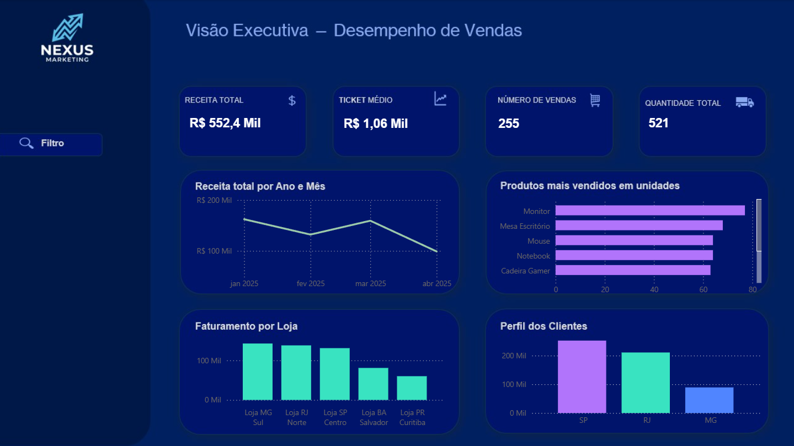

# 📊 Dashboard Executivo de Vendas

## 🎯 Objetivo
Este projeto tem como objetivo simular um cenário real de **análise de dados em varejo**, transformando dados transacionais em **insights claros para tomada de decisão gerencial**.

A solução contempla desde a **modelagem e análise dos dados em SQL** até a **visualização interativa no Power BI**, com foco em clareza, organização visual e visão executiva.

---

## 🛠️ Tecnologias Utilizadas
- MySQL  
- SQL (JOIN, GROUP BY, funções de agregação, filtros e ordenações)  
- Power BI  
- Power Query  
- Modelagem de Dados Relacional  
- PowerPoint / Figma (planejamento do layout e design do dashboard)

---

## 🗂️ Base de Dados
A base de dados foi estruturada em **MySQL**, simulando um ambiente real de varejo, com as seguintes tabelas:

- **vendas** (fato principal)
- **clientes**
- **produtos**
- **lojas**

As tabelas foram relacionadas por meio de **chaves primárias e estrangeiras**, garantindo integridade e consistência dos dados.  
Os dados são simulados para fins de estudo, respeitando regras de negócio realistas.

---

## 🔍 Análises Realizadas em SQL
Antes da visualização no Power BI, as principais análises foram desenvolvidas diretamente em SQL, garantindo validação dos dados na origem.

Entre as análises realizadas estão:

- Receita total
- Faturamento mensal
- Ticket médio
- Produtos mais vendidos (quantidade)
- Produtos com maior faturamento
- Faturamento por loja
- Ranking de clientes por receita
- Análise de vendas por estado

Essas análises serviram como base para os indicadores apresentados no dashboard.

---

## 📈 Dashboard no Power BI
O dashboard foi desenvolvido com foco em **visão executiva**, permitindo análise rápida e objetiva dos dados.

Principais elementos do dashboard:
- KPIs principais (receita total, ticket médio, quantidade de vendas)
- Evolução da receita ao longo do tempo
- Ranking de produtos
- Desempenho por loja
- Perfil dos clientes por estado
- Painel de filtros interativo acionado por botão

Os filtros foram posicionados de forma estratégica para **não poluir a tela principal**, mantendo uma experiência limpa e profissional.

### 📷 Prévia do Dashboard

---

## 🎨 Design e Experiência do Usuário (UX)
O layout do dashboard foi planejado previamente utilizando **PowerPoint / Figma**, com foco em:

- Hierarquia visual da informação
- Organização e alinhamento dos elementos
- Clareza na leitura dos indicadores
- Aparência profissional para apresentações executivas

Após o planejamento visual, o layout foi aplicado no Power BI, onde os gráficos, KPIs e interações foram construídos.

---

## 🚀 Próximos Passos
Possíveis evoluções para o projeto:
- Inclusão de metas de vendas
- Comparação com períodos anteriores
- Indicadores de crescimento percentual
- Segmentação por categorias de produtos
- Análise de sazonalidade

---

## 👤 Autor
**Philipe L.**  
Estudante de Análise de Dados, com foco em **SQL, Power BI e visualização de dados**, buscando transformar dados em informações relevantes para o negócio.
